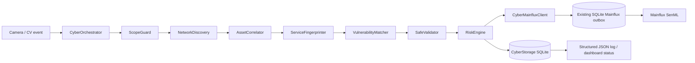

# Autonomous Cyber Camera Agent — kiến trúc defensive

Phần cyber là một extension độc lập của Camera Agent. Nó chỉ dùng cho thiết bị thuộc lab/owner hoặc phạm vi đã được ủy quyền bằng văn bản. Mục tiêu là quan sát, định danh dịch vụ, đối chiếu lỗ hổng, kiểm tra read-only, chấm điểm rủi ro và báo cáo; không có exploit runner.

## Luồng dữ liệu

State machine của mỗi lần chạy:

`IDLE → DISCOVERING → CORRELATING → FINGERPRINTING → MATCHING_VULNS → VALIDATING → SCORING → PUBLISHING → DONE`

Nếu một stage lỗi, lỗi được ghi theo tên stage và pipeline đóng an toàn. Target ngoài allowlist dừng ngay ở `ScopeGuard` với mã `DENIED_OUTSIDE_SCOPE`.

## Trách nhiệm module

- `config.py`: đọc YAML, validate mode, scope, timeout, weights và các cờ cấm; không đọc/in secret ngoài env reference.
- `scope_guard.py`: parse IP, allowlist subnet/host, deny list và public-IP policy. Đây là gate bắt buộc trước TCP/HTTP/TLS/RTSP.
- `discovery.py`: candidate host bounded, ICMP/ARP fallback TCP, mDNS listen giới hạn và một SSDP M-SEARCH; concurrency/rate limit/deduplicate.
- `fingerprint.py`: TCP connect, banner ngắn, HTTP `HEAD`, TLS handshake metadata và RTSP `OPTIONS`. Không SYN stealth, UDP flood hay stream `PLAY`.
- `vuln_matcher.py`: local cache NVD/CISA KEV; remote feed tắt mặc định, không hard-code CVE.
- `safe_validator.py`: security headers, banner disclosure, admin/health exposure, directory listing, TLS certificate metadata và RTSP auth challenge; không đoán credential.
- `correlator.py`: kết hợp class từ CV với vendor/hostname/MAC/service/timing. Confidence thấp luôn là `UNCONFIRMED`.
- `risk_engine.py`: quy đổi CVSS, exploitability/KEV, exposure và asset value về score 0–10.
- `mainflux_client.py`: chuyển event thành SenML và gọi `MainfluxPublisher` hiện có, nên kế thừa retry/outbox partition theo destination.
- `storage.py`: chỉ lưu IP/metadata/finding/risk/event; không lưu password, token, cookie, response body hay frame.

CV hiện tại của product là computer-screen detector, không phải model nhận diện router/camera/laptop vật lý. Hook tích hợp mặc định truyền `device_class=unknown`; operator có thể khai báo class cho lab bằng env nhưng correlation vẫn không được coi là bằng chứng định danh tuyệt đối.

## Isolation với runtime cũ

`CYBER_AGENT_ENABLED` mặc định không bật. Khi tắt, camera agent cũ không tạo cyber worker. Khi bật, `FleetAgent` hoặc legacy `agent.py` gửi status event sang một worker cyber duy nhất với cooldown; worker không chặn vòng inference. `--dry-run` của cyber suppress mọi network packet và Mainflux publish.

Mainflux cyber event dùng publisher/outbox hiện hành, với `device_id`/destination riêng. Route mặc định vẫn là `/http/messages`; nếu deployment yêu cầu channel route, đặt `MAINFLUX_CHANNEL_ID` và xác minh bằng preflight của deployment trước khi rollout.
